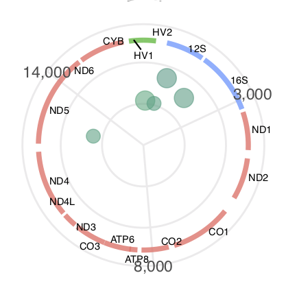

```{r setup, include=FALSE}
knitr::opts_chunk$set(
  results = 'asis', 
  echo = FALSE
)

library(glue)
library(tidyverse)
library(fontawesome)

# Set this to true to have links turned into footnotes at the end of the document
PDF_EXPORT <- FALSE

# Holds all the links that were inserted for placement at the end
links <- c()

source("parsing_functions.R")

# Load csv with position info
position_data <- read_csv("positions.csv")
```


```{r}
read_file("citations.bib") %>% 
    gsub("@(.+?),", "\n@\\1,\n", .) %>%
    gsub("},", "},\n", .) %>% 
  write_file("citations_corrected.bib")
```


```{r}
# When in export mode the little dots are unaligned, so fix that. 
if (PDF_EXPORT) {
  cat("
  <style>
  :root{
    --decorator-outer-offset-left: -6.5px;
  }
  </style>")
}
```


Aside
================================================================================


{width=50%}

```{r}
# When in export mode the little dots are unaligned, so fix that. 
if (PDF_EXPORT) {
  cat("View this CV online with links at _ginolhac/cv_")
} else {
  cat("[<i class='fas fa-download'></i> Download a PDF of this CV](https://github.com/ginolhac/cv-1/raw/master/ginolhac_cv.pdf)")
}
```

Contact {#contact}
--------------------------------------------------------------------------------


- <i class="fa fa-envelope"></i> ginolhac@gmail.com
- <i class="fa fa-github"></i> github.com/ginolhac
- <i class="fa fa-link"></i> [lsru bioinfo core](https://wwwen.uni.lu/research/fstc/life_sciences_research_unit/core_positions/bioinformatics)
- <i class="fa fa-phone"></i> (352) 661-172104


Skills {#skills}
--------------------------------------------------------------------------------

Proficient in

- `r fa("r-project", fill = "steelblue", height = "12px")`
- `r fa("linux")` GNU/Linux environment
- HPC with `slurm`

Experienced with

- python
- Bash
- GNU AWK


Disclaimer {#disclaimer}
--------------------------------------------------------------------------------

Last updated on `r Sys.Date()`.


Main
================================================================================

Aurélien Ginolhac {#title}
--------------------------------------------------------------------------------


```{r}
intro_text <- "Bioanalyst, Providing bioinformatic services to the [_Life Sciences Research Unit_](https://wwwen.uni.lu/research/fstc/life_sciences_research_unit)"

cat(sanitize_links(intro_text))
```


Education {data-icon=graduation-cap data-concise=true}
--------------------------------------------------------------------------------

```{r}
print_section(position_data, 'education')
```


Research Experience {data-icon=laptop}
--------------------------------------------------------------------------------

```{r}
print_section(position_data, 'research_positions')
```


Industry Experience {data-icon=industry}
--------------------------------------------------------------------------------

::: aside

:::

```{r}
print_section(position_data, 'industry_positions')
```

<br>


Teaching Experience {data-icon=chalkboard-teacher}
--------------------------------------------------------------------------------


```{r}
print_section(position_data, 'teaching_positions')
```


Publications {data-icon=book}
--------------------------------------------------------------------------------

::: aside

### Summary

- Total number of peer-reviewed publications: **27**
    + **5** as leading author
- Total number of citations: **1,732**
- Average citation **54.13**
- ORCID ID: [0000-0001-7665-9547](https://orcid.org/0000-0001-7665-9547)

### H-index: **18**

:::

```{r}
bibdf <- bib2df::bib2df("citations.bib")
print_articles(bibdf, type = "ARTICLE", cv_author = "Ginolhac, A")
```

Patents {data-icon=atlas}
--------------------------------------------------------------------------------


```{r}
print_articles(bibdf, type = "PATENT", cv_author = "Ginolhac, A")
```


